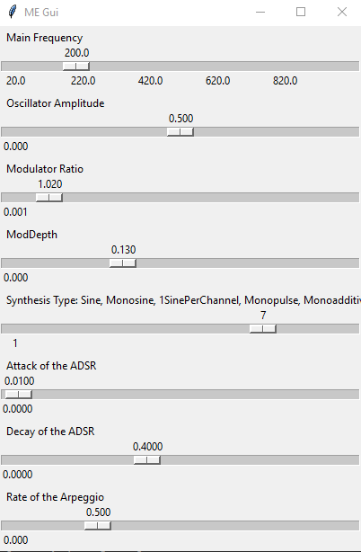

# Python synthesizer

MySynthesizer is build upon code by Marc Groenewegen en Ciska Vriezinga. MySynthesizer is a very simple music synthesis application. This was my first synthesizer ever written. 

The program should be ran by running MySynthesizer.py. Python 3.6 or later is needed.
The PyAudio module is also required:
```pip install PyAudio```

The synth has a: 
- ADSR
- Amplifier
- Averagefilter with LP & HP
- White Noise
- FM
- AM
- Sine, Additive Saw, Pulse 



### Status


